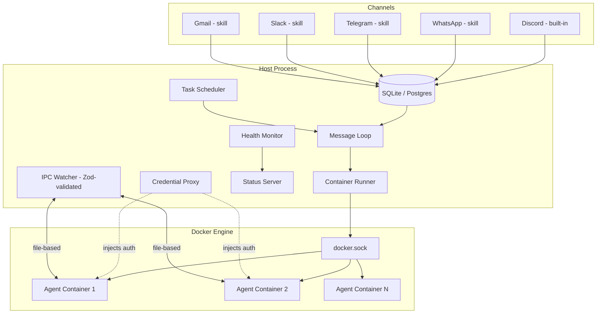
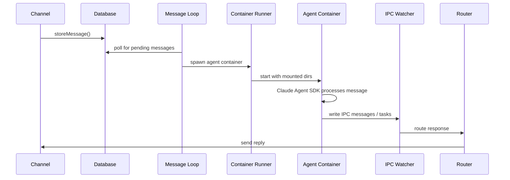
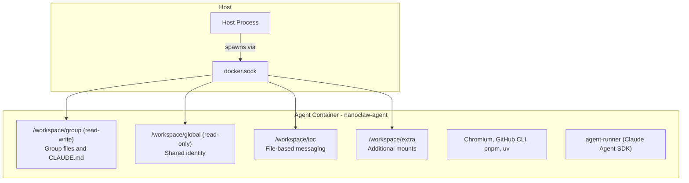

<p align="center">
  
</p>

<p align="center">
  A personal AI assistant that runs Claude agents securely in their own containers.
</p>

<p align="center">
  <a href="https://github.com/trevorWieland/nanoclaw/actions/workflows/ci.yml"></a>
  <a href="https://github.com/trevorWieland/nanoclaw/actions/workflows/container-build.yml"></a>
  
  
</p>

---

NanoClaw is a single Node.js process that orchestrates Claude agents running in isolated Linux containers. It connects to your messaging channels (Discord built-in; WhatsApp, Telegram, Slack, Gmail via skills), gives each group its own memory and filesystem, schedules recurring tasks, and routes everything through a credential proxy that never exposes secrets to the agents.

## Architecture Overview



The host process itself can run in Docker (Docker-out-of-Docker pattern), mounting the host's `docker.sock` to spawn agent containers alongside itself.

## Features

- **Multi-channel messaging** -- Discord built-in; WhatsApp, Telegram, Slack, Gmail added via skills
- **Container-isolated agent execution** -- Docker (macOS/Linux) or Apple Container (macOS)
- **Per-group memory isolation** -- each group gets its own `CLAUDE.md`, filesystem, and container sandbox
- **SQLite (default) or Postgres** database backend
- **Zod-validated IPC** between host and containers (file-based, schema-enforced)
- **Credential proxy** -- OAuth token management on the host; secrets never enter containers
- **Scheduled tasks** -- cron, interval, and one-shot jobs that run Claude and message you back
- **Health monitoring** with extensible sources and a status server
- **Tanren integration** for VM provisioning and dispatch
- **Docker-out-of-Docker** for fully containerized deployment
- **Agent Swarms** -- teams of specialized agents collaborating on complex tasks
- **Mount security** with external allowlist enforcement
- **Auth circuit breaker** to prevent retry storms on token expiry
- **Skills-as-branches architecture** -- extensibility without bloating core

## Quick Start

```bash
gh repo fork trevorWieland/nanoclaw --clone
cd nanoclaw
claude
```

<details>
<summary>Without GitHub CLI</summary>

1. Fork [trevorWieland/nanoclaw](https://github.com/trevorWieland/nanoclaw) on GitHub (click the Fork button)
2. `git clone https://github.com/<your-username>/nanoclaw.git`
3. `cd nanoclaw`
4. `claude`

</details>

Then run `/setup`. Claude Code handles everything: dependencies, authentication, container setup, and service configuration.

> **Note:** Commands prefixed with `/` (like `/setup`, `/add-whatsapp`) are [Claude Code skills](https://code.claude.com/docs/en/skills). Type them inside the `claude` CLI prompt, not in your regular terminal. If you don't have Claude Code installed, get it at [claude.ai/download](https://claude.ai/download).

## Message Flow



## Container Architecture



Each agent container is an isolated Linux environment with only explicitly mounted directories visible. The `agent-runner` package inside the container drives the Claude Agent SDK. Containers have Chromium for web access, GitHub CLI, pnpm, and uv pre-installed.

## Philosophy

**Small enough to understand.** One process, a few source files, no microservices. If you want to understand the full codebase, just ask Claude Code to walk you through it.

**Secure by isolation.** Agents run in Linux containers and can only see what's explicitly mounted. Bash access is safe because commands run inside the container, not on your host. The credential proxy ensures agents never touch real auth secrets.

**Built for the individual user.** NanoClaw is not a monolithic framework. It is software that fits each user's exact needs. Instead of becoming bloatware, NanoClaw is designed to be bespoke. You make your own fork and have Claude Code modify it to match your needs.

**Customization = code changes.** No configuration sprawl. Want different behavior? Modify the code. The codebase is small enough that it is safe to make changes.

**AI-native.**

- No installation wizard; Claude Code guides setup.
- No monitoring dashboard; ask Claude what's happening.
- No debugging tools; describe the problem and Claude fixes it.

**Skills over features.** Instead of adding features to the codebase, contributors submit skills like `/add-telegram` that transform your fork. You end up with clean code that does exactly what you need.

**Best harness, best model.** NanoClaw runs on the Claude Agent SDK, which means you are running Claude Code directly. Its coding and problem-solving capabilities allow it to modify and expand NanoClaw and tailor it to each user.

## Customization and Skills

NanoClaw uses a skills-as-branches architecture with four skill types:

- **Feature skills** -- merge a `skill/*` branch to add capabilities (e.g. `/add-telegram`, `/add-slack`)
- **Utility skills** -- ship code files alongside a SKILL.md (e.g. `/claw`)
- **Operational skills** -- instruction-only workflows, always on `main` (e.g. `/setup`, `/debug`)
- **Container skills** -- loaded inside agent containers at runtime (`container/skills/`)

See [CONTRIBUTING.md](CONTRIBUTING.md) for the full taxonomy, guidelines, and how to create new skills. See [docs/skills-as-branches.md](docs/skills-as-branches.md) for architecture details.

## Fork Relationship

This repository is Trevor Wieland's fork of upstream [qwibitai/nanoclaw](https://github.com/qwibitai/nanoclaw). Upstream provides the core orchestrator, channel system, and skills architecture.

**This fork adds:**

- Postgres database backend
- Docker-out-of-Docker containerized deployment
- Health monitoring with extensible sources and status server
- Auth circuit breaker and credential proxy enhancements
- Tanren integration for VM provisioning
- Modernized toolchain (pnpm, oxfmt, oxlint, tsgo, vitest, turbo, knip)
- Extracted modules (group-processor, message-loop, recovery)

Substantial features and bug fixes are routed upstream. See [docs/FORK_OVERVIEW.md](docs/FORK_OVERVIEW.md) for the full list of intentional divergences and [docs/FORK_SYNC.md](docs/FORK_SYNC.md) for sync procedures.

## Requirements

- macOS or Linux
- Node.js 24+
- pnpm
- [Claude Code](https://claude.ai/download)
- [Docker](https://docker.com/products/docker-desktop) (macOS/Linux) or [Apple Container](https://github.com/apple/container) (macOS)

## Key Files

| File                       | Purpose                                               |
| -------------------------- | ----------------------------------------------------- |
| `src/index.ts`             | Orchestrator: state, message loop, agent invocation   |
| `src/channels/registry.ts` | Channel registry (self-registration at startup)       |
| `src/ipc.ts`               | IPC watcher and task processing                       |
| `src/ipc-schemas.ts`       | Zod schemas for all IPC message types                 |
| `src/router.ts`            | Message formatting and outbound routing               |
| `src/container-runner.ts`  | Spawns streaming agent containers                     |
| `src/credential-proxy.ts`  | Host-side credential proxy for containers             |
| `src/task-scheduler.ts`    | Runs scheduled tasks                                  |
| `src/db.ts`                | Database operations (delegates to datastore adapters) |
| `src/datastore/`           | SQLite and Postgres adapter implementations           |
| `src/health-monitor.ts`    | Health status tracking and reporting                  |
| `src/tanren/`              | Tanren API client (VM provisioning)                   |
| `container/agent-runner/`  | Container-side agent package (Claude Agent SDK)       |
| `groups/*/CLAUDE.md`       | Per-group memory (isolated)                           |

## Contributing

Read [CONTRIBUTING.md](CONTRIBUTING.md) before opening a PR.

**Don't add features. Add skills.**

## FAQ

**Why Docker?**

Docker provides cross-platform support (macOS, Linux, and Windows via WSL2) and a mature ecosystem. The host process itself can run in Docker using the Docker-out-of-Docker pattern, spawning agent containers via a mounted `docker.sock`. On macOS, you can optionally switch to Apple Container via `/convert-to-apple-container` for a lighter-weight native runtime. For additional isolation, [Docker Sandboxes](docs/docker-sandboxes.md) run each container inside a micro VM.

**Is this secure?**

Agents run in containers, not behind application-level permission checks. They can only access explicitly mounted directories. The credential proxy on the host handles OAuth tokens so that secrets never enter the container. You should still review what you are running, but the codebase is small enough that you actually can. See [docs/SECURITY.md](docs/SECURITY.md) for the full security model.

**Why no configuration files?**

No configuration sprawl. Every user should customize NanoClaw so that the code does exactly what they want, rather than configuring a generic system. If you prefer config files, you can tell Claude to add them.

**Can I use third-party or open-source models?**

Yes. NanoClaw supports any Claude API-compatible model endpoint. Set these environment variables in your `.env` file:

```bash
ANTHROPIC_BASE_URL=https://your-api-endpoint.com
ANTHROPIC_AUTH_TOKEN=your-token-here
```

This allows you to use local models via [Ollama](https://ollama.ai) with an API proxy, open-source models on [Together AI](https://together.ai) or [Fireworks](https://fireworks.ai), or custom deployments with Anthropic-compatible APIs. The model must support the Anthropic API format for best compatibility.

**How do I debug issues?**

Ask Claude Code. "Why isn't the scheduler running?" "What's in the recent logs?" "Why did this message not get a response?" That is the AI-native approach. You can also run `/debug` for guided troubleshooting.

**What changes will be accepted into the codebase?**

Only security fixes, bug fixes, and clear improvements to the base system. Everything else (new capabilities, OS compatibility, hardware support, enhancements) should be contributed as skills. This keeps the base system minimal and lets every user customize their installation without inheriting features they don't want.

## Community

Questions? Ideas? [Join the Discord](https://discord.gg/VDdww8qS42).

## License

MIT
