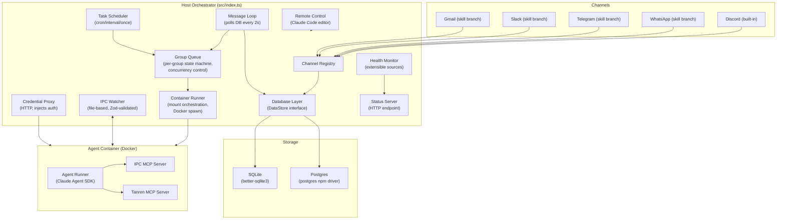

# NanoClaw Architecture

> **Fork-specific note:** This documents `trevorWieland/nanoclaw`, which adds Postgres backend support, Docker-out-of-Docker container deployment, health monitoring, Tanren VM integration, auth circuit breaker, message deduplication, and modernized tooling (pnpm, oxfmt, oxlint, turbo, knip) over upstream `qwibitai/nanoclaw`.

See [SPEC.md](SPEC.md) for implementation-level details. See [SECURITY.md](SECURITY.md) for the trust model and threat mitigations.

---

## 1. Overview

NanoClaw is a personal AI assistant that runs Claude agents inside Docker containers. A single Node.js process (the host orchestrator) manages messaging channels, a database, a task scheduler, and a container execution pipeline. Messages arrive from channels (Discord, WhatsApp, Telegram, Slack, Gmail), get stored in the database, and trigger container-isolated Claude Agent SDK sessions. Each messaging group gets its own filesystem, session state, and IPC namespace.

---

## 2. System Architecture

---

## 3. Host Orchestrator

`src/index.ts` is the composition root. On startup it:

1. Ensures the container runtime (Docker) is running and cleans up orphaned containers from previous runs (labeled with `INSTANCE_ID`).
2. Initializes the database via the DataStore factory.
3. Loads persisted state: last-processed timestamps, sessions, registered groups, pending tail-drain cursors.
4. Syncs project metadata (CLAUDE.md, docs/, skills/) to a read-only mount directory.
5. Restores any active remote control session from disk.
6. Applies declarative group registrations (from `registered-groups.json` for container deployments).
7. Starts the credential proxy (containers route all API traffic through it).
8. Starts the status server for external dashboards.
9. Connects all registered channels (factory pattern; unconfigured channels are skipped).
10. Starts the health monitor with configured sources.
11. Wires up the group processor with injected dependencies and starts: task scheduler, IPC watcher, message recovery, and the message polling loop.

Graceful shutdown (`SIGTERM`/`SIGINT`) closes the proxy, status server, drains the group queue, and disconnects channels.

---

## 4. Database Layer

The database stores chat metadata, messages, scheduled tasks, router state, sessions, and registered groups.

**DataStore interface** (`src/datastore/types.ts`): defines all database operations. Both adapters implement the same interface, so the rest of the codebase is storage-agnostic.

**Factory** (`src/datastore/factory.ts`): the `DB_BACKEND` environment variable (`"sqlite"` or `"postgres"`) selects which adapter is instantiated at startup.

**SQLite adapter** (default): uses `better-sqlite3`. Database file lives at `DATA_DIR/store/messages.db` (or the path specified in `DATABASE_URL`). Schema is created inline on first run.

**Postgres adapter**: uses the `postgres` npm driver. Requires `DATABASE_URL` to be a Postgres connection string. Runs migrations on startup.

---

## 5. Channel System

Channels are the messaging interfaces through which users interact with the agent.

**Registry pattern** (`src/channels/registry.ts`): channels self-register by calling `registerChannel(name, factory)` at import time. The barrel file `src/channels/index.ts` imports all installed channel modules, triggering registration.

**Discord** (`src/channels/discord.ts`): the only channel built into the core codebase.

**Other channels** (WhatsApp, Telegram, Slack, Gmail): installed via skill branches that are merged into the user's fork. Each branch adds a channel module that calls `registerChannel()`.

**Channel interface**: each channel implements `connect()`, `disconnect()`, `sendMessage()`, `ownsJid()`, `isConnected()`, and `getChats()`. Optional methods include `purge()`, `start()`, `syncGroups()`, and `sendEmbed()`.

At startup, the orchestrator iterates registered channel names, calls each factory, and connects. Factories return `null` when credentials are missing, so unconfigured channels are silently skipped.

---

## 6. Container Execution

### Container Runner (`src/container-runner.ts`)

Orchestrates the full lifecycle of an agent container:

1. Creates the group directory if needed.
2. Builds volume mounts (group files, global memory, IPC, sessions, skills, agent-runner source, additional mounts from allowlist).
3. Generates Docker CLI arguments (resource limits, networking, environment variables, timezone).
4. Spawns the container process via `docker run -i --rm`.
5. Writes `ContainerInput` JSON to the container's stdin.
6. Parses streaming output delimited by sentinel markers (`---NANOCLAW_OUTPUT_START---` / `---NANOCLAW_OUTPUT_END---`).
7. Tracks auth errors in the circuit breaker.
8. Writes container logs to `DATA_DIR/logs/<group>/`.

### Container Runtime (`src/container-runtime.ts`)

Abstracts Docker-specific logic:

- Binary name, host gateway hostname, proxy bind address detection.
- Docker-out-of-Docker support: when the host NanoClaw itself runs in Docker, `CONTAINER_HOST_CONFIG_DIR` and `CONTAINER_HOST_DATA_DIR` translate container-internal paths to host-side paths for Docker `-v` sources.
- Orphan cleanup: finds containers labeled `nanoclaw.instance=<INSTANCE_ID>` and stops them.

### Mount Orchestration

| Mount             | Container Path         | Access       | Purpose                                |
| ----------------- | ---------------------- | ------------ | -------------------------------------- |
| Group folder      | `/workspace/group`     | rw           | Group-specific files, CLAUDE.md        |
| Global memory     | `/workspace/global`    | ro           | Shared identity (non-main only)        |
| All groups        | `/workspace/groups`    | ro           | Cross-group visibility (main only)     |
| Project meta      | `/workspace/project`   | ro           | Synced docs/skills (main only)         |
| IPC namespace     | `/workspace/ipc`       | rw           | Messages, tasks, input, close sentinel |
| Claude sessions   | `/home/node/.claude`   | rw           | Session persistence, settings, skills  |
| Agent runner src  | `/app/src`             | rw           | Customizable agent-runner source       |
| uv cache          | `/home/node/.cache/uv` | rw           | Persistent Python package cache        |
| Additional mounts | (per config)           | (per config) | Validated against mount allowlist      |

### Resource Limits

- `CONTAINER_MEMORY_LIMIT` (default `"4g"`), per-group override via `containerConfig.memoryLimit`
- `CONTAINER_CPU_LIMIT` (default `"2"`), per-group override via `containerConfig.cpuLimit`
- Exit code 137 (SIGKILL) with memory limits set triggers an OOM warning

---

## 7. Agent Runner (Container-Side)

The agent runner is a separate npm package at `container/agent-runner/`. It runs inside each container.

**Entry** (`container/agent-runner/src/index.ts`): reads `ContainerInput` JSON from stdin, configures the Claude Agent SDK, and calls `query()`.

**IPC polling loop**: after the initial query, the runner watches `/workspace/ipc/input/` for follow-up message files. Each file contains `{type:"message", text:"..."}`. The sentinel file `/workspace/ipc/input/_close` signals the session should end.

**MCP servers**: two optional MCP servers run as child processes:

- **IPC MCP** (`ipc-mcp-stdio.ts`): exposes host communication tools (send messages, manage tasks, register groups).
- **Tanren MCP** (`tanren-mcp-stdio.ts`): exposes VM provisioning and dispatch operations (main group only).

**Session management**: resumes from an existing session ID if provided in `ContainerInput`. Stores the new session ID in the output for the host to persist.

**Workspace layout**:

- `/workspace/group` -- group-specific working directory
- `/workspace/global` -- shared identity (read-only for non-main)
- `/workspace/ipc` -- IPC namespace (messages/, tasks/, input/)
- `/workspace/extra` -- additional mounts from allowlist

---

## 8. IPC System

IPC between host and containers is file-based. All schemas are defined in `src/ipc-schemas.ts` using Zod.

### Container-to-Host

Containers write JSON files to their IPC namespace directories:

- **Messages** (`/workspace/ipc/messages/`): outbound messages to channels. Schema: `IpcMessageSchema` (type, chatJid, text, optional sender).
- **Tasks** (`/workspace/ipc/tasks/`): task operations. Schema: `TaskIpcSchema` (discriminated union on `type`). Supported operations: `schedule_task`, `pause_task`, `resume_task`, `cancel_task`, `update_task`, `register_group`, `refresh_groups`.
- **Stdout markers**: `ContainerOutputSchema` JSON wrapped in sentinel markers for streaming output.

Container-to-host schemas use `.passthrough()` so containers can include metadata fields the host ignores.

### Host-to-Container

- **Follow-up messages** (`/workspace/ipc/input/`): JSON files with `{type:"message", text:"..."}`. Schema: `FollowUpMessageSchema`.
- **Close sentinel** (`/workspace/ipc/input/_close`): signals the container to end its session.
- **Stdin**: initial `ContainerInput` JSON. Schema: `ContainerInputSchema`.

Host-to-container schemas use `.strict()` -- extra fields indicate a host bug.

### Host-Side Processing

The IPC watcher (`src/ipc.ts`) polls `DATA_DIR/ipc/` at 1-second intervals, scanning per-group IPC directories. Group identity is determined by directory name. IPC actions are authorized based on the source group's privileges (main vs non-main).

---

## 9. Credential Proxy

The credential proxy (`src/credential-proxy.ts`) is an HTTP server that isolates API credentials from containers.

**How it works**: containers set `ANTHROPIC_BASE_URL` to the proxy address. All API traffic routes through the proxy, which injects real credentials before forwarding to the upstream API (Anthropic or custom endpoint).

**Two auth modes**:

- **API key mode**: proxy injects `x-api-key` header on every request. Containers receive `ANTHROPIC_API_KEY=placeholder`.
- **OAuth mode**: proxy injects the real OAuth `Bearer` token on the token exchange request. Containers receive `CLAUDE_CODE_OAUTH_TOKEN=placeholder`.

**Token resolution order** (OAuth mode):

1. `.env` `CLAUDE_CODE_OAUTH_TOKEN` (long-lived, from `claude setup-token`)
2. `~/.claude/.credentials.json` (short-lived, from `/login`) -- auto-refreshed when expired via OAuth2 `refresh_token` grant

**Port**: `CREDENTIAL_PROXY_PORT` (default 3001). Bind address is auto-detected: docker0 bridge IP on Linux, loopback on macOS/Docker Desktop, `0.0.0.0` when `CREDENTIAL_PROXY_EXTERNAL_URL` is set.

Containers never receive real credentials.

---

## 10. Health Monitoring

**Health Monitor** (`src/health-monitor.ts`): polls registered health sources at a configurable interval. Caches health status and recent events. Sends embed notifications to configured channels on state transitions (healthy/unhealthy).

**Health Sources** (`src/health-sources/`): pluggable health check implementations. Each source implements `checkHealth()` and `fetchEvents()`. Currently includes:

- `TanrenHealthSource`: checks Tanren API health and polls for VM events.

**Health Embeds** (`src/health-embeds.ts`): formats health status, events, and monitor errors as structured embeds (Discord format) or plain text fallback.

**Status Server** (`src/status-server.ts`): HTTP endpoint (default port 3002, bind address `STATUS_BIND_HOST`) returning a JSON snapshot of system state: queue status, connected channels, tasks, registered groups, health status, and recent events.

---

## 11. Tanren Integration

Tanren is an optional VM provisioning service for dispatching coding work to remote VMs.

**Host-side client** (`src/tanren/client.ts`): API client with retry/backoff logic. Created at startup if `TANREN_API_URL` and `TANREN_API_KEY` are set. Performs a non-blocking health check on startup.

**Container-side MCP** (`container/agent-runner/src/tanren-mcp-stdio.ts`): exposes VM provisioning and dispatch operations as MCP tools. Only available to main group containers (tanren config is passed in `ContainerInput` only for main groups).

**Error handling**: custom `TanrenAPIError` class. Container-side implementation is intentionally minimal (raw fetch, no retry) -- the host-side client handles retry/backoff for orchestrator use.

---

## 12. Operational Resilience

**Auth Circuit Breaker** (`src/auth-circuit-breaker.ts`): tracks consecutive 401/403 failures from container exits. After repeated failures, blocks credential reads with backoff cooldown. Resets on successful container completion.

**Message Dedup** (`src/message-dedup.ts`): SHA256 fingerprint of outbound messages prevents duplicate sends within a time window.

**Sender Allowlist** (`src/sender-allowlist.ts`): optional JSON config at `CONFIG_ROOT/sender-allowlist.json` restricts who can trigger `@mention` interactions. Supports per-chat and default rules, with a drop mode that discards messages from denied senders before processing.

**Recovery** (`src/recovery.ts`): on startup, scans for messages that arrived while the process was down and re-enqueues them for processing.

**Group Queue** (`src/group-queue.ts`): per-group state machine managing container concurrency.

- States: idle, pending, active, idle-waiting, error, retry
- Global concurrency limit: `MAX_CONCURRENT_CONTAINERS` (default 5)
- Retry with exponential backoff (base 5s, max 5 retries)
- Follow-up messages delivered to running containers via IPC stdin
- Close sentinel sent when idle timeout expires
- Tracks active process, container name, and group folder per group

---

## 13. Configuration

### Three-Root Model

All paths are env-configurable for containerized deployment. When unset, they collapse to `PROJECT_ROOT`-relative defaults.

| Root          | Env Var                | Default               | Purpose                              |
| ------------- | ---------------------- | --------------------- | ------------------------------------ |
| `APP_DIR`     | `NANOCLAW_APP_DIR`     | `process.cwd()`       | Immutable application code           |
| `CONFIG_ROOT` | `NANOCLAW_CONFIG_ROOT` | `process.cwd()`       | Groups, allowlists, `.env`           |
| `DATA_DIR`    | `NANOCLAW_DATA_DIR`    | `<PROJECT_ROOT>/data` | Sessions, database, cache, IPC, logs |

### Key Environment Variables

| Variable                        | Default           | Purpose                                                  |
| ------------------------------- | ----------------- | -------------------------------------------------------- |
| `ASSISTANT_NAME`                | `"Andy"`          | Bot trigger name (`@Andy`)                               |
| `DB_BACKEND`                    | `"sqlite"`        | Database adapter: `"sqlite"` or `"postgres"`             |
| `DATABASE_URL`                  | (auto)            | SQLite file path or Postgres connection string           |
| `CONTAINER_IMAGE`               | (required)        | Docker image for agent containers                        |
| `CONTAINER_TIMEOUT`             | `1800000` (30m)   | Max container runtime (ms)                               |
| `CONTAINER_MEMORY_LIMIT`        | `"4g"`            | Container memory limit                                   |
| `CONTAINER_CPU_LIMIT`           | `"2"`             | Container CPU limit                                      |
| `CONTAINER_MAX_OUTPUT_SIZE`     | `10485760` (10MB) | Max stdout/stderr capture per container                  |
| `MAX_CONCURRENT_CONTAINERS`     | `5`               | Global container concurrency limit                       |
| `CREDENTIAL_PROXY_PORT`         | `3001`            | Credential proxy listen port                             |
| `STATUS_PORT`                   | `3002`            | Status server listen port                                |
| `STATUS_BIND_HOST`              | `"127.0.0.1"`     | Status server bind address                               |
| `POLL_INTERVAL`                 | `2000`            | Message polling interval (ms)                            |
| `SCHEDULER_POLL_INTERVAL`       | `60000`           | Task scheduler check interval (ms)                       |
| `IDLE_TIMEOUT`                  | `1800000` (30m)   | Container idle timeout after last output                 |
| `TANREN_API_URL`                | (unset)           | Tanren API endpoint (enables integration)                |
| `TANREN_API_KEY`                | (unset)           | Tanren API key                                           |
| `AGENT_NETWORK`                 | (unset)           | Docker network for sibling container communication       |
| `CONTAINER_HOST_CONFIG_DIR`     | (unset)           | Host-side CONFIG_ROOT path (Docker-out-of-Docker)        |
| `CONTAINER_HOST_DATA_DIR`       | (unset)           | Host-side DATA_DIR path (Docker-out-of-Docker)           |
| `CREDENTIAL_PROXY_EXTERNAL_URL` | (unset)           | Override proxy URL for containers (Docker-out-of-Docker) |

---

## 14. Remote Control

Remote control (`src/remote-control.ts`) allows starting a Claude Code editor session from a messaging channel.

- Triggered by `/remote-control` command in a main group chat.
- Requires admin authorization: `is_from_me` or an explicit (non-wildcard) sender allowlist entry.
- Spawns a `claude` process in the NanoClaw project directory, captures the session URL, and sends it back to the chat.
- `/remote-control-end` stops the session.
- Session state is persisted to `DATA_DIR/remote-control.json` and restored on restart.

---

## 15. Skills Architecture

NanoClaw uses a git-branch-based skills system. See [skills-as-branches.md](skills-as-branches.md) for the full design.

Four skill types:

1. **Feature skills** -- git branches (e.g., `skill/add-telegram`) merged into the user's fork to add capabilities like new channels or integrations.
2. **Utility skills** -- standalone tools shipped as a `SKILL.md` file plus supporting code. Invoked by the agent at runtime.
3. **Operational skills** -- instruction-only workflows (e.g., `/setup`, `/debug`) that guide the agent through multi-step procedures. Always on `main`.
4. **Container skills** -- loaded inside agent containers at runtime from `container/skills/`. Synced into each group's `.claude/skills/` directory before container launch.
